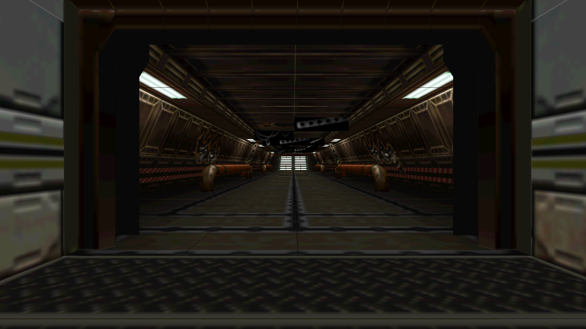
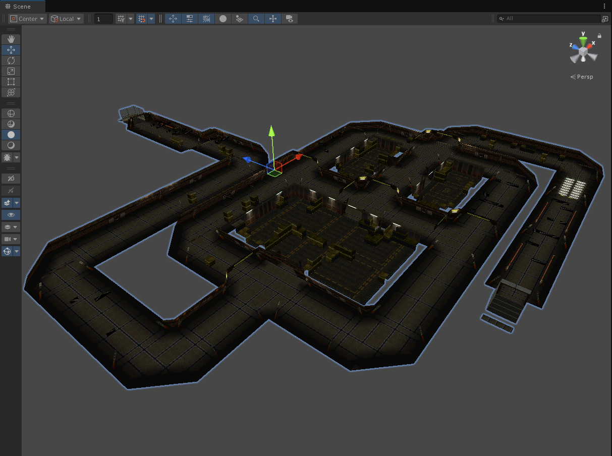

# Alien Trilogy Unity
Load data directly from original Alien Trilogy files into Unity

## Origin
Based on the wonderful work of https://github.com/Thor110/AlienTrilogyResurrection

## Usage
* Create a new Unity project (Unity 6000+ LTS)
* Create an empty gameobject and add the AlienTrilogyMapLoader.cs as a new component
* Connect the file paths to your original Alien Trilogy .MAP and .B16 files
* Create and connect a new material (unlit texture cutout)
* Start the game inside Unity and see the map loaded into the scene

## Screenshots

